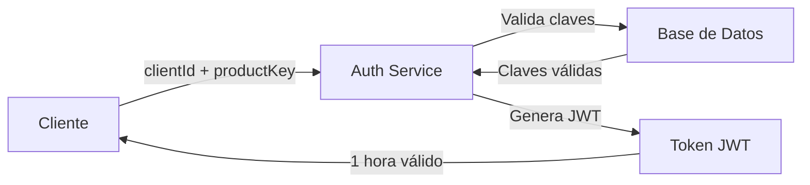

# 🔐 Auth Service - Microservicio de Autenticación JWT


[](https://github.com/markesiano/Mark-Auth)
[](https://opensource.org/licenses/MIT)
[](./SECURITY.md)
[](./src/test)

**Microservicio seguro para autenticación JWT con sistema de doble clave y arquitectura Clean Architecture**

[🚀 Inicio Rápido](#-inicio-rápido-seguro) • [⚙️ Configuración](#️-configuración-de-repositorio-jwt) • [🔑 API](#-modelo-de-autenticación) • [🔒 Seguridad](#-seguridad) • [🛠️ Desarrollo](#️-desarrollo) • [📄 Licencia](#-licencia)


---

Este es un microservicio de autenticación que gestiona sesiones JWT para sistemas backend distribuidos usando un **sistema de doble clave** (ClientId + ProductKey). Implementa las mejores prácticas de seguridad, Clean Architecture y está completamente preparado para entornos de producción.

### Características Principales

- 🔐 **Autenticación JWT** con algoritmo HS256
- 🔑 **Sistema de Doble Clave** - ClientId + ProductKey para validación robusta
- 🚀 **Arquitectura Asíncrona** usando CompletableFuture
- 📦 **Cache Escalable** - Redis opcional, InMemory con ConcurrentHashMap como alternativa
- 🏗️ **Clean Architecture** con separación de capas
- 🧪 **Tests Unitarios** con cobertura completa (92 tests ejecutados)
- 🐳 **Docker Ready** para despliegue en contenedores
- ⚡ **Escalabilidad** - Funciona con o sin Redis, cache en memoria con expiración automática

## Tecnologías Utilizadas

| Tecnología | Versión | Propósito |
|------------|---------|-----------|
| **Java** | 21 | Lenguaje de programación |
| **Spring Boot** | 3.5.3 | Framework principal |
| **Spring Security** | 6.0+ | Seguridad y autenticación |
| **JWT (JJWT)** | 0.11.5 | Tokens de autenticación |
| **Redis** | 7.0+ | Cache de sesiones (opcional) |
| **WebFlux** | 3.0+ | Cliente HTTP reactivo |
| **JUnit 5** | 5.9+ | Testing framework |
| **Mockito** | 4.0+ | Mocking para tests |
| **Maven** | 3.8+ | Gestión de dependencias |
| **Docker** | 20.0+ | Containerización |

## Arquitectura

```
┌─────────────────┐    ┌─────────────────┐    ┌─────────────────┐
│   Controller    │───▶│   Use Cases     │───▶│  Infrastructure │
│   (REST API)    │    │  (Business)     │    │   (Data/Redis)  │
└─────────────────┘    └─────────────────┘    └─────────────────┘
         │                       │                       │
         ▼                       ▼                       ▼
   HTTP Requests          Business Logic         Data Persistence
```

### Estructura de Directorios

```
src/
├── main/java/com/markesiano/auth_service/
│   ├── application/
│   │   ├── entities/          # Entidades de dominio
│   │   ├── exceptions/        # Excepciones de negocio
│   │   ├── interfaces/        # Contratos/Puertos
│   │   └── usecases/         # Casos de uso
│   ├── config/               # Configuraciones generales
│   ├── controller/           # Controladores REST
│   ├── infraestructure/      # Capa de infraestructura
│   │   ├── config/          # Configuraciones específicas
│   │   ├── data/            # Repositorios e implementaciones
│   │   ├── dtos/            # Objetos de transferencia de datos
│   │   └── security/        # Seguridad y autenticación JWT
│   └── AuthServiceApplication.java  # Clase principal
├── main/resources/
│   ├── application.yml       # Configuración de la aplicación
│   └── logback-spring.xml   # Configuración de logs
└── test/java/               # Tests unitarios (92 tests)
    ├── com/auth/application/    # Tests de casos de uso
    ├── com/auth/controller/     # Tests de controladores
    ├── com/auth/data/          # Tests de repositorios
    └── com/auth/security/      # Tests de seguridad
```

## 📑 Tabla de Contenidos

- [🚀 Inicio Rápido Seguro](#-inicio-rápido-seguro)
- [⚙️ Configuración de Repositorio JWT](#️-configuración-de-repositorio-jwt)
- [🌐 Endpoints Disponibles](#-endpoints-disponibles)
- [🔑 Modelo de Autenticación](#-modelo-de-autenticación)
- [📊 Variables de Entorno](#-variables-de-entorno-requeridas)
- [🔒 Seguridad](#-seguridad)
- [⚡ Escalabilidad y Flexibilidad](#-escalabilidad-y-flexibilidad)
- [👥 Configuración de Clientes](#-configuración-de-clientes)
- [🛠️ Desarrollo](#️-desarrollo)

## Información de Seguridad IMPORTANTE

**ANTES DE USAR ESTE CÓDIGO, LEE COMPLETAMENTE EL ARCHIVO [`SECURITY.md`](./SECURITY.md)**

### Configuración Crítica Requerida

1. **Variables de Entorno**: Este servicio requiere configuración de variables de entorno para funcionar de manera segura.
2. **Secretos JWT**: NUNCA uses valores por defecto en producción.

## ⚡ Quick Start

```bash
# 1. Clonar repositorio
git clone https://github.com/markesiano/Mark-Auth.git && cd Mark-Auth

# 2. Configurar variables de entorno
export JWT_SECRET="your-super-secure-jwt-secret-here"
export JWT_REPOSITORY_TYPE="memory"

# 3. Ejecutar aplicación
./mvnw spring-boot:run

# 4. Probar API
curl -X POST http://localhost:8080/auth/token \
  -H "Content-Type: application/json" \
  -d '{"clientId": "markepos01", "productKey": "productKey1"}'
```

## 🚀 Inicio Rápido Seguro

### 📋 Prerrequisitos

- ☕ **Java 21** o superior (requerido - el proyecto usa Java 21)
- 🐳 **Docker** (opcional - para contenedores)
- 🗄️ **Redis** (opcional - para cache distribuido en producción)  
- 🛠️ **Maven 3.8+** (o usar el wrapper incluido `./mvnw`)

> **⚠️ Nota**: Este proyecto requiere **Java 21**. Asegúrate de tener la versión correcta instalada:
> ```bash
> java -version  # Debe mostrar version 21.x.x
> ```

### 🔧 Instalación

1. **Clonar el repositorio**:
   ```bash
   git clone https://github.com/markesiano/Mark-Auth.git
   cd Mark-Auth
   ```

2. **Configurar variables de entorno**:
   ```bash
   cp .env.example .env
   # Editar .env con valores reales y seguros
   nano .env
   ```

3. **Generar secret JWT seguro**:
   ```bash
   # OpenSSL
   openssl rand -base64 64
   ```

4. **Ejecutar tests**:
   ```bash
   ./mvnw test
   ```

5. **Ejecutar aplicación**:

   **🐳 Opción 1: Docker (RECOMENDADO para Producción)**
   ```bash
   # Construir imagen Docker
   docker build -t auth-service:latest .
   
   # Ejecutar con variables de entorno
   docker run -p 8080:8080 \
     -e JWT_SECRET="your-super-secure-jwt-secret-key" \
     -e JWT_REPOSITORY_TYPE="memory" \
     auth-service:latest
   
   # O usar archivo .env
   docker run -p 8080:8080 --env-file .env auth-service:latest
   ```

   **💻 Opción 2: Ejecución Local (Manual)**
   
   *Windows (PowerShell):*
   ```powershell
   $env:JWT_REPOSITORY_TYPE="memory"
   $env:JWT_SECRET="your-super-secure-jwt-secret-key-here-minimum-256-bits"
   .\mvnw.cmd spring-boot:run
   ```
   
   *Linux/Mac (Bash):*
   ```bash
   export JWT_REPOSITORY_TYPE=memory
   export JWT_SECRET=your-super-secure-jwt-secret-key-here-minimum-256-bits
   ./mvnw spring-boot:run
   ```

   **🔧 Opción 3: Una sola línea (Cross-platform)**
   
   *Windows:*
   ```powershell
   $env:JWT_REPOSITORY_TYPE="memory"; $env:JWT_SECRET="your-secret"; .\mvnw.cmd spring-boot:run
   ```
   
   *Linux/Mac:*
   ```bash
   JWT_REPOSITORY_TYPE=memory JWT_SECRET=your-secret ./mvnw spring-boot:run
   ```

   > **💡 Nota**: Spring Boot NO lee archivos .env automáticamente. Por eso recomendamos Docker o configurar las variables manualmente como se muestra arriba.

### ⚙️ Configuración de Repositorio JWT

El microservicio soporta **dos implementaciones de repositorio JWT** que puedes alternar fácilmente:

#### 🏗️ Opciones de Implementación

| Tipo | Implementación | Ideal para | Persistencia |
|------|---------------|------------|--------------|
| **Memory** | `InMemoryJwtRepository` | Desarrollo, testing | En memoria (se pierde al reiniciar) |
| **Redis** | `RedisJwtRepository` | Producción, cluster | Redis distribuido |

#### 🔧 Configuración Simple

**Para usar repositorio en memoria (por defecto):**
```bash
JWT_REPOSITORY_TYPE=memory
```

**Para usar repositorio Redis:**
```bash
JWT_REPOSITORY_TYPE=redis
REDIS_URI=redis://localhost
REDIS_PORT=6379
```

### 🌐 Endpoints Disponibles

| Endpoint | Método | Descripción | Status Code |
|----------|--------|-------------|-------------|
| `/auth/token` | POST | Generar token JWT | 200 (éxito), 400 (bad request), 401 (unauthorized) |

#### ✅ Verificar que el Servicio Funciona

```bash
# Verificar que el servicio responde
curl -i http://localhost:8080/auth/token

# Debería responder con HTTP 400 (sin body es inválido)
# HTTP/1.1 400 Bad Request
```

### 🔑 Modelo de Autenticación

Este microservicio utiliza un **sistema de doble clave** para la autenticación:

#### 📝 Claves Requeridas

| Campo | Descripción | Ejemplo | Propósito |
|-------|-------------|---------|-----------|
| `clientId` | **Clave del Cliente** - Identificador único del cliente/aplicación | `markepos01` | Identifica qué cliente está solicitando autenticación |
| `productKey` | **Clave del Producto** - Clave específica del producto/servicio | `productKey1` | Valida que el cliente tiene acceso al producto específico |

#### 🔐 Flujo de Autenticación



#### 📋 Estructura de Request

```json
{
  "clientId": "markepos01",     // ✅ Requerido: Clave del cliente
  "productKey": "productKey1"   // ✅ Requerido: Clave del producto
}
```

#### ✅ Estructura de Response (Éxito)

```json
{
  "token": "eyJhbGciOiJIUzI1NiJ9.eyJzdWIiOiJtYXJrZXBvczAxIiwiaWF0IjoxNjU5..."
}
```

#### ❌ Estructura de Response (Error de Validación - 400 Bad Request)

```json
{
  "error": "Bad request",
  "message": "Client ID cannot be null or empty"
}
```

#### ❌ Estructura de Response (Error de Autenticación - 401 Unauthorized)

```json
{
  "error": "Authentication failed",
  "message": "Invalid clientId or productKey"
}
```

#### Ejemplo de Uso

```bash
# Generar token
curl -X POST http://localhost:8080/auth/token \
  -H "Content-Type: application/json" \
  -d '{
    "clientId": "markepos01",
    "productKey": "productKey1"
  }'

# Respuesta exitosa
{
  "token": "eyJhbGciOiJIUzI1NiJ9..."
}

# Ejemplo con curl para diferentes clientes
curl -X POST http://localhost:8080/auth/token \
  -H "Content-Type: application/json" \
  -d '{
    "clientId": "restaurant01",
    "productKey": "posSystem"
  }'

curl -X POST http://localhost:8080/auth/token \
  -H "Content-Type: application/json" \
  -d '{
    "clientId": "store02", 
    "productKey": "inventoryApp"
  }'
```

#### 🎯 Casos de Uso Típicos

| Escenario | ClientId | ProductKey | Descripción |
|-----------|----------|------------|-------------|
| **POS Restaurant** | `restaurant01` | `posSystem` | Sistema de punto de venta para restaurante |
| **Inventory App** | `store02` | `inventoryApp` | Aplicación de inventario para tienda |
| **Mobile App** | `mobile_client` | `customerApp` | App móvil para clientes |
| **Admin Dashboard** | `admin_panel` | `backoffice` | Panel administrativo |

> **🔒 Seguridad**: Cada combinación `clientId + productKey` es única y debe estar pre-registrada en el sistema. El token JWT generado incluye el `clientId` en el claim `subject` para identificación posterior.

### 📊 Variables de Entorno Requeridas

| Variable | Descripción | Ejemplo | Requerido |
|----------|-------------|---------|-----------|
| `JWT_SECRET` | Secret para firmar tokens JWT (mín. 256 bits) | `dGVzdC1zZWNyZXQ...` | ✅ Sí |
| `JWT_REPOSITORY_TYPE` | Tipo de repositorio JWT | `memory` o `redis` | ❌ Opcional (default: memory) |
| `SERVER_PORT` | Puerto del servidor | `8080` | ❌ Opcional (default: 8080) |
| `REDIS_URI` | URI de Redis para cache distribuido | `redis://localhost` | ❌ Opcional |
| `REDIS_PORT` | Puerto de Redis | `6379` | ❌ Opcional |
| `SPRING_PROFILES_ACTIVE` | Perfil de Spring activo | `prod`, `dev` | ⚠️ Recomendado (default: dev) |

#### ⚙️ Configuración de Variables de Entorno

**🐳 Con Docker (RECOMENDADO)**

Docker permite configurar variables fácilmente:

```bash
# 1. Configurar variables de entorno (crea tu propio .env)
cp .env.example .env
nano .env  # Editar valores

# 2. Ejecutar con Docker
docker build -t auth-service .
docker run -p 8080:8080 --env-file .env auth-service
```

**💻 Configuración Manual**

Si no usas Docker, configura las variables manualmente:

*Windows (PowerShell):*
```powershell
# Configurar variables (permanente en sesión)
$env:JWT_SECRET="tu-secret-jwt-super-seguro-aqui"
$env:JWT_REPOSITORY_TYPE="memory"

# Ejecutar aplicación
.\mvnw.cmd spring-boot:run
```

*Linux/Mac (Bash):*
```bash
# Configurar variables (permanente en sesión)
export JWT_SECRET="tu-secret-jwt-super-seguro-aqui"
export JWT_REPOSITORY_TYPE="memory"

# Ejecutar aplicación
./mvnw spring-boot:run
```

*Una sola línea (cualquier SO):*
```bash
# Windows
$env:JWT_SECRET="tu-secret"; $env:JWT_REPOSITORY_TYPE="memory"; .\mvnw.cmd spring-boot:run

# Linux/Mac
JWT_SECRET="tu-secret" JWT_REPOSITORY_TYPE="memory" ./mvnw spring-boot:run
```

> **⚠️ Importante**: Spring Boot NO lee archivos `.env` automáticamente. Usa Docker o configura las variables manualmente como se muestra arriba.

> **💡 Nota de Escalabilidad**: Redis es completamente opcional. Sin Redis, el servicio utiliza `InMemoryJwtRepository` con `ConcurrentHashMap` y expiración automática de tokens, ideal para aplicaciones de menor escala o entornos de desarrollo.

### 🔒 Seguridad


[](./SECURITY.md)
[](./SECURITY.md)
[](./SECURITY.md)


#### Características de Seguridad

- ✅ **Sin secretos hardcodeados** - Toda configuración sensible via variables de entorno
- ✅ **Algoritmos seguros** - HS256 para JWT, SecureRandom para tests
- ✅ **Validación robusta** - Entrada validada en todos los endpoints
- ✅ **Tests de seguridad** - Verificación automatizada de vulnerabilidades
- ✅ **Cache seguro** - Tokens almacenados con expiración automática
- ✅ **Arquitectura defensiva** - Manejo de excepciones y casos edge

### ⚡ Escalabilidad y Flexibilidad

El servicio está diseñado para adaptarse a diferentes escalas de uso:

#### 🏠 **Modo Standalone (Sin Redis)**
- **Ideal para**: Desarrollo, pruebas, aplicaciones pequeñas-medianas
- **Cache**: `InMemoryJwtRepository` con `ConcurrentHashMap`
- **Expiración**: Automática después de 1 hora (mismo tiempo que JWT)
- **Ventajas**: Sin dependencias externas, arranque rápido, configuración mínima

#### 🌐 **Modo Distribuido (Con Redis)**
- **Ideal para**: Producción, múltiples instancias, alta disponibilidad
- **Cache**: `RedisJwtRepository` para cache compartido
- **Expiración**: Sincronizada con tiempo de vida del JWT (1 hora)
- **Ventajas**: Cache compartido, persistencia, escalabilidad horizontal

```bash
# Ejecutar sin Redis (modo standalone)
./mvnw spring-boot:run
```

### 📚 Documentación

| Documento | Descripción |
|-----------|-------------|
| [`SECURITY.md`](./SECURITY.md) | 🔒 Guía completa de seguridad y mejores prácticas |

### 👥 Configuración de Clientes

Para que un cliente pueda autenticarse, debe estar pre-registrado en el sistema con su combinación única de `clientId` y `productKey`. 

#### 📋 Registro de Nuevos Clientes

```bash
# Estructura típica de datos de cliente
{
  "clientId": "unique_client_identifier",
  "productKey": "product_access_key", 
  "permissions": ["read", "write"],
  "status": "active"
}
```

> **💡 Nota**: La gestión de clientes (registro, actualización, eliminación) se maneja a través del repositorio `InMemoryClientKeyRepository` que puede ser extendido para usar base de datos según necesidades del proyecto.

### 🛠️ Desarrollo

#### 🧪 Testing

```bash
# Ejecutar todos los tests
./mvnw test

# Tests específicos
./mvnw test -Dtest=AuthControllerTest
```

#### 🔨 Construcción

```bash
# Compilar
./mvnw clean compile

# Empaquetar
./mvnw clean package

# Empaquetar sin tests (solo CI/CD)
./mvnw clean package -DskipTests

# Verificar calidad de código
./mvnw clean verify
```

#### 🐳 Docker

```bash
# Construir imagen
docker build -t auth-service:latest .

# Ejecutar con variables de entorno
docker run -p 8080:8080 \
  -e JWT_SECRET="your-secret-key" \
  -e JWT_REPOSITORY_TYPE="memory" \
  auth-service:latest

# Ejecutar con archivo .env
docker run -p 8080:8080 --env-file .env auth-service:latest

# Ver logs
docker logs <container-id>

# Parar contenedor
docker stop <container-id>
```

---

## 📄 Licencia

Este proyecto está licenciado bajo la Licencia MIT - ver el archivo [LICENSE](LICENSE) para más detalles.


---